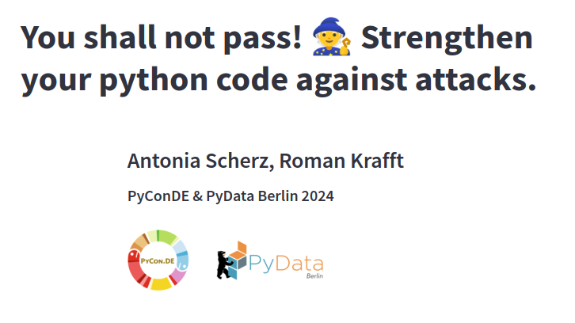

# Repo to PyConDE2024 Talk

To see the presentation clone the repo and run:

''' poetry shell '''

to set up the environment and then run:

''' streamlit run Home.py '''

You can find links to supplementary material and sources in the last tab of the page '04 Python Security Practices'

